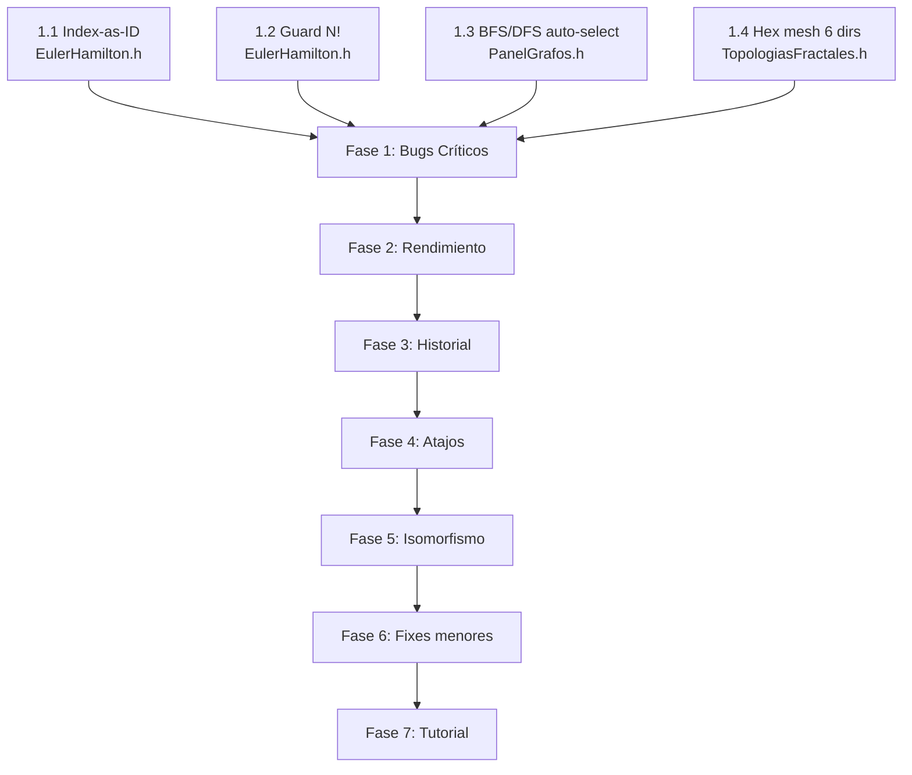

# Plan de Implementación Completo — GraphCore

> Auditoría exhaustiva + plan de ejecución basado en los documentos de feedback del compañero y el plan de isomorfismo geométrico/topológico.

---

## Resumen Ejecutivo

Se identificaron **14 problemas concretos** y **3 módulos nuevos** a implementar. El plan está ordenado por **prioridad de impacto** (bugs críticos primero, features nuevas después) y cada tarea indica **exactamente qué archivo tocar y por qué**.

---

## Fase 1 — Bugs Críticos (Crasheos y Funcionalidad Rota)

### 1.1 🚨 Bug de Index-as-ID en EulerHamilton.h

**Archivo**: [EulerHamilton.h](file:///home/giuseppe/Escritorio/GraphCore/src/nucleo/algoritmos/EulerHamilton.h)

**Problema**: El vector `grados` se dimensiona con `g.nodos.size()` pero se indexa con `arista.origen_id`. Después de borrar nodos, los IDs pueden exceder el tamaño del vector → **crash por acceso fuera de límites**. Lo mismo pasa con `visitado` en Hamilton y con accesos `g.nodos[camino[i]].nombre` que asumen que el índice del vector == ID del nodo.

**Solución**:
```cpp
// ANTES (crashea si hay nodos borrados):
std::vector<int> grados(g.nodos.size(), 0);

// DESPUÉS (seguro siempre):
std::vector<int> grados(g.rangoIds(), 0);
```

Y reemplazar TODOS los accesos `g.nodos[id].nombre` por búsqueda segura:
```cpp
// ANTES:
g.nodos[camino[i]].nombre

// DESPUÉS:
g.nombreNodo(camino[i])
```

**Líneas afectadas**: ~18, ~86, ~127, ~150, ~191 del archivo.

**Impacto**: Elimina el crash de Hamiltoniano y Euleriano en grafos donde se hayan borrado nodos.

---

### 1.2 🚨 Hamiltoniano O(N!) sin protección — Crash en Koch iter 5

**Archivo**: [EulerHamilton.h](file:///home/giuseppe/Escritorio/GraphCore/src/nucleo/algoritmos/EulerHamilton.h)

**Problema**: `buscarCaminoHamiltoniano()` usa backtracking puro O(N!) sin límite. Koch iter 5 genera ~3×4⁵ = 3072 segmentos → miles de nodos. N! para N>15 ya congela la app.

**Solución**:
```cpp
inline ResultadoEulerHamilton buscarCaminoHamiltoniano(const Grafo& g) {
    ResultadoEulerHamilton res;
    
    // ── Cortafuegos: más de 20 nodos → solo heurístico ──
    if (g.nodos.size() > 20) {
        res.encontrado = false;
        res.descripcion = "Grafo demasiado grande para búsqueda exacta (>"
                          + std::to_string(20) + " nodos). Use el método heurístico.";
        return res;
    }
    // ... backtracking original ...
}
```

**En la UI** ([PanelGrafos.h](file:///home/giuseppe/Escritorio/GraphCore/src/interfaz/paneles/PanelGrafos.h), sección CatEulerHamilton):
- Si el grafo tiene >20 nodos, deshabilitar el botón exacto y ofrecer automáticamente el heurístico con un aviso:
  
```cpp
if (red.nodos.size() > 20) {
    ImGui::TextColored(ImVec4(1,0.4f,0,1), ICON_FA_TRIANGLE_EXCLAMATION 
        " Grafo grande: solo búsqueda heurística disponible");
}
```

---

### 1.3 🐛 BFS/DFS "deshabilitados" en Windows

**Archivos**: [PanelGrafos.h](file:///home/giuseppe/Escritorio/GraphCore/src/interfaz/paneles/PanelGrafos.h) (subpanelBFS, subpanelDFS)

**Problema**: El compañero reporta que BFS/DFS aparecen con "cuadro rojo" (deshabilitados). Investigación: los botones se renderizan siempre, PERO el combo de selección de nodo usa `nodo.id` y si ningún nodo está seleccionado/válido, el inicio queda en -1 → el botón NO ejecuta nada y muestra el estado de error.

**Solución**: Auto-seleccionar el primer nodo disponible si `bfs_nodo_inicio == -1`:
```cpp
// Al inicio de subpanelBFS:
if (self.estado_grafos.bfs_nodo_inicio == -1 && !red.nodos.empty()) {
    self.estado_grafos.bfs_nodo_inicio = red.nodos[0].id;
}
```
Mismo patrón para DFS. Verificar también que el nodo seleccionado sigue existiendo (pudo haberse borrado).

---

### 1.4 🐛 Malla Hexagonal incompleta

**Archivo**: [TopologiasFractales.h](file:///home/giuseppe/Escritorio/GraphCore/src/nucleo/algoritmos/TopologiasFractales.h) — función `generarMallaHexagonal()`

**Problema**: Solo conecta 3 de las 6 direcciones vecinas del hexágono. Los hexágonos quedan "abiertos" — vértices con solo 1 arista en lugar de las 2-3 mínimas para cerrar la figura.

**Solución**: Expandir las direcciones de conexión a las 6 del grid hexagonal axial:
```cpp
// ANTES: solo 3 direcciones
const int dq[] = {1, 0, 1};
const int dr[] = {0, 1, -1};

// DESPUÉS: las 6 direcciones del hexágono
const int dq[] = {1, 0, -1, -1,  0,  1};
const int dr[] = {0, 1,  1,  0, -1, -1};
```

Y agregar verificación de duplicados al conectar (ya que ahora cada par se visita dos veces):
```cpp
if (id1 < id2) {  // evitar aristas duplicadas
    g.agregarArista(id1, id2, 1.0f);
}
```

---

## Fase 2 — Mejoras de Rendimiento y Optimización

### 2.1 ⚡ Optimizar renderizado de fractales pesados (Koch iter 5+)

**Archivos**: 
- [LienzoRed.h](file:///home/giuseppe/Escritorio/GraphCore/src/interfaz/lienzo/LienzoRed.h)
- [TopologiasFractales.h](file:///home/giuseppe/Escritorio/GraphCore/src/nucleo/algoritmos/TopologiasFractales.h)

**Problema**: Koch iter 5 genera ~3072 segmentos y baja a <10 FPS. El renderizado dibuja CADA nodo con `AddCircleFilled` (costoso para miles de nodos) y CADA arista individualmente.

**Soluciones**:

1. **Culling de viewport**: Solo dibujar nodos/aristas visibles en la ventana actual:
```cpp
ImVec2 canvas_min = ImGui::GetWindowPos();
ImVec2 canvas_max = {canvas_min.x + ImGui::GetWindowWidth(), 
                     canvas_min.y + ImGui::GetWindowHeight()};

for (auto& nodo : red.nodos) {
    ImVec2 screen_pos = worldToScreen(nodo.posicion);
    if (screen_pos.x < canvas_min.x - nodo.radio || 
        screen_pos.x > canvas_max.x + nodo.radio ||
        screen_pos.y < canvas_min.y - nodo.radio || 
        screen_pos.y > canvas_max.y + nodo.radio)
        continue; // fuera de vista, no dibujar
    // ... dibujar nodo ...
}
```

2. **LOD (Level of Detail)**: Si hay >500 nodos, reducir `num_segments` de los círculos:
```cpp
int segments = (red.nodos.size() > 500) ? 6 : 
               (red.nodos.size() > 200) ? 8 : 12;
draw_list->AddCircleFilled(pos, radio, color, segments);
```

3. **Batch de aristas**: Usar `AddLine` en batch con `PathLineTo` + `PathStroke` para reducir draw calls.

**Meta**: Koch iter 5 a 30+ FPS, evaluar iter 6 como máximo funcional.

---

### 2.2 ⚡ Radio dinámico de vértices en fractales

**Archivos**: 
- [TopologiasFractales.h](file:///home/giuseppe/Escritorio/GraphCore/src/nucleo/algoritmos/TopologiasFractales.h) — cada función generadora
- [PanelGrafos.h](file:///home/giuseppe/Escritorio/GraphCore/src/interfaz/paneles/PanelGrafos.h) — sección CatFractales

**Problema**: `reset_fractal` fija `radio = 20.0f` para todos los nodos, sin importar cuántos hay. Con 200+ nodos, los círculos tapan las aristas completamente.

**Solución**: Calcular radio proporcional al número de nodos:
```cpp
// En reset_fractal (PanelGrafos.h):
float radio_base = std::max(3.0f, 20.0f - std::log2(float(red.nodos.size())) * 2.5f);
for (auto& n : red.nodos) n.radio = radio_base;
```

| Nodos | Radio |
|-------|-------|
| 3-10 | 17-15 |
| 50 | ~6 |
| 200+ | 3 (mínimo) |

**Adicional**: Agregar botón "Ocultar Vértices" en el panel de fractales (toggle):
```cpp
static bool ocultar_vertices_fractal = false;
ImGui::Checkbox("Ocultar Vértices", &ocultar_vertices_fractal);
```
Y en [LienzoRed.h](file:///home/giuseppe/Escritorio/GraphCore/src/interfaz/lienzo/LienzoRed.h), antes de dibujar cada nodo:
```cpp
if (ocultar_vertices_fractal && /* estamos en modo fractal */) continue;
```

---

### 2.3 ⚡ Euler/Hamilton — Botón Instantáneo faltante

**Archivo**: [PanelGrafos.h](file:///home/giuseppe/Escritorio/GraphCore/src/interfaz/paneles/PanelGrafos.h) — sección CatEulerHamilton (~línea 1369)

**Problema**: Solo hay botón de animación. Debería haber "Instantáneo" + "Animación" como en Dijkstra/BFS/DFS.

**Solución**: Duplicar el patrón de Dijkstra. Agregar botón "Instantáneo" que ejecute el algoritmo sin crear pasos de animación, y solo muestre el resultado coloreando la ruta:

```cpp
// Botón existente (mantener):
if (ImGui::Button(ICON_FA_PLAY " Buscar Circuito Euleriano (Animación)")) { ... }

// Botón nuevo:
if (ImGui::Button(ICON_FA_BOLT " Buscar Circuito Euleriano (Instantáneo)")) {
    auto res = EulerHamilton::buscarCaminoEuleriano(red, nodo_inicio);
    if (res.encontrado) {
        self.estado_grafos.ruta_optima = res.ruta;
        self.registrarLog("Circuito Euleriano encontrado: " + 
                         std::to_string(res.ruta.size()) + " nodos");
    } else {
        self.registrarLog("No se encontró circuito Euleriano");
    }
}
```
Mismo patrón para Hamiltoniano.

---

## Fase 3 — Módulo de Historial (Undo/Redo)

### 3.1 🆕 Crear HistorialGrafos

**Archivo nuevo**: [src/nucleo/HistorialGrafos.hpp](file:///home/giuseppe/Escritorio/GraphCore/src/nucleo/)

**Diseño** (Memento + RAII, sin memory leaks):

```cpp
#pragma once
#include "Grafo.h"
#include <deque>

struct HistorialGrafos {
    static constexpr size_t MAX_HISTORIAL = 50;
    
    std::deque<Grafo> undo_stack;
    std::deque<Grafo> redo_stack;

    void capturar(const Grafo& estado_actual) {
        if (undo_stack.size() >= MAX_HISTORIAL)
            undo_stack.pop_front(); // O(1) en deque
        undo_stack.push_back(estado_actual);
        redo_stack.clear(); // nueva acción invalida el redo
    }

    bool deshacer(Grafo& actual) {
        if (undo_stack.empty()) return false;
        redo_stack.push_back(actual);
        actual = undo_stack.back();
        undo_stack.pop_back();
        return true;
    }

    bool rehacer(Grafo& actual) {
        if (redo_stack.empty()) return false;
        undo_stack.push_back(actual);
        actual = redo_stack.back();
        redo_stack.pop_back();
        return true;
    }

    bool puede_deshacer() const { return !undo_stack.empty(); }
    bool puede_rehacer() const { return !redo_stack.empty(); }
};
```

**Por qué `std::deque`**: `pop_front()` es O(1). Con `std::vector` sería O(N) al quitar el snapshot más viejo.

**Integración**:
- Agregar `HistorialGrafos historial;` en [EstadoUI.h](file:///home/giuseppe/Escritorio/GraphCore/src/interfaz/estado/EstadoUI.h) o como miembro en [Interfaz.h](file:///home/giuseppe/Escritorio/GraphCore/src/interfaz/Interfaz.h)
- Llamar `historial.capturar(red)` ANTES de cada acción destructiva:
  - Borrar nodo (Delete/Backspace en LienzoRed.h)
  - Limpiar grafo (Ctrl+N en LienzoRed.h)
  - Cargar topología precargada
  - Generar fractal
  - Agregar/eliminar arista

---

## Fase 4 — Motor de Atajos de Teclado

### 4.1 🆕 Controlador central de atajos

**Archivo nuevo**: [src/interfaz/util/AtajosTeclado.h](file:///home/giuseppe/Escritorio/GraphCore/src/interfaz/util/)

```cpp
#pragma once
#include "../Interfaz.h"
#include "../../nucleo/HistorialGrafos.hpp"

namespace AtajosTeclado {

inline void procesar(Grafo& red, HistorialGrafos& historial, 
                     EstadoUI& ui) {
    ImGuiIO& io = ImGui::GetIO();
    
    // ── BLOQUEO: si ImGui captura el teclado (InputText), no hacer nada ──
    if (io.WantCaptureKeyboard) return;

    bool ctrl  = io.KeyCtrl;
    bool shift = io.KeyShift;

    // [Ctrl+Z] → Deshacer
    if (ctrl && !shift && ImGui::IsKeyPressed(ImGuiKey_Z)) {
        if (historial.deshacer(red))
            /* log: "Acción deshecha" */;
    }
    // [Ctrl+Y] o [Ctrl+Shift+Z] → Rehacer
    else if ((ctrl && ImGui::IsKeyPressed(ImGuiKey_Y)) ||
             (ctrl && shift && ImGui::IsKeyPressed(ImGuiKey_Z))) {
        if (historial.rehacer(red))
            /* log: "Acción rehecha" */;
    }
    // [Ctrl+L] → Limpiar todo
    else if (ctrl && ImGui::IsKeyPressed(ImGuiKey_L)) {
        historial.capturar(red);
        red.limpiar();
    }
    // [Ctrl+A] → Seleccionar todos los nodos
    else if (ctrl && ImGui::IsKeyPressed(ImGuiKey_A)) {
        // marcar todos los nodos como seleccionados
        // (requiere agregar vector<bool> seleccion_multiple en EstadoUI)
    }
    // [Delete/Backspace] → Borrar nodo seleccionado (ya existe, mover aquí)
    else if (ImGui::IsKeyPressed(ImGuiKey_Delete) || 
             ImGui::IsKeyPressed(ImGuiKey_Backspace)) {
        if (ui.nodo_seleccionado != -1) {
            historial.capturar(red);
            red.eliminarNodo(ui.nodo_seleccionado);
            ui.nodo_seleccionado = -1;
        }
    }
}

} // namespace AtajosTeclado
```

**Integración**: Llamar `AtajosTeclado::procesar(red, historial, estado_ui)` en [LienzoRed.h](file:///home/giuseppe/Escritorio/GraphCore/src/interfaz/lienzo/LienzoRed.h) al inicio de `dibujar()`, y REMOVER los handlers duplicados de Ctrl+N y Delete que ya están ahí (líneas 372-388).

### 4.2 Tooltips en botones de la UI

**Archivo**: [PanelGrafos.h](file:///home/giuseppe/Escritorio/GraphCore/src/interfaz/paneles/PanelGrafos.h), [Toolbar.h](file:///home/giuseppe/Escritorio/GraphCore/src/interfaz/componentes/Toolbar.h)

Agregar tooltips a TODOS los botones que tengan atajo:
```cpp
if (ImGui::Button(ICON_FA_TRASH " Limpiar")) { ... }
if (ImGui::IsItemHovered()) 
    ImGui::SetTooltip("Limpiar grafo completo (Ctrl+L)");
```

---

## Fase 5 — Isomorfismo (2 Botones Separados)

### 5.1 🆕 Isomorfismo Geométrico (botón nuevo, ultra-preciso)

**Archivo existente**: [Isomorfismo.h](file:///home/giuseppe/Escritorio/GraphCore/src/nucleo/algoritmos/Isomorfismo.h) — agregar nueva función

```cpp
struct ResultadoIsoGeometrico {
    bool son_isomorfos = false;
    std::string descripcion;
    float error_maximo = 0.0f;
};

// O(V²) — seguro para cualquier tamaño de grafo
inline ResultadoIsoGeometrico verificarGeometrico(const Grafo& g1, const Grafo& g2) {
    ResultadoIsoGeometrico res;
    
    if (g1.nodos.size() != g2.nodos.size() || 
        g1.aristas.size() != g2.aristas.size()) {
        res.descripcion = "Diferente cantidad de nodos o aristas";
        return res;
    }

    // 1. Normalizar posiciones al centro de masa y escala unitaria
    // 2. Para cada nodo de g1, buscar el nodo más cercano en g2
    // 3. Verificar que el mapeo preserva todas las aristas
    // 4. Tolerancia: FLT_EPSILON para coincidencia exacta

    // ... implementación completa ...
    return res;
}
```

**Clave**: Este es O(N²), NO tiene el problema de O(N!) del topológico. Es seguro para CUALQUIER grafo.

### 5.2 Modificar UI del Isomorfismo — 2 botones separados

**Archivo**: [PanelIsomorfismo.h](file:///home/giuseppe/Escritorio/GraphCore/src/interfaz/paneles/PanelIsomorfismo.h)

**Antes**: 1 botón "Verificar Isomorfismo"  
**Después**: 2 botones claramente separados:

```cpp
ImGui::Separator();
ImGui::TextColored(titulo_color, ICON_FA_SHUFFLE " Verificación Topológica");
ImGui::TextWrapped("Compara estructura del grafo (backtracking). "
                   "Limitado a ≤12 nodos.");
                   
bool habilitado_topo = (red.nodos.size() <= 12 && 
                        self.estado_grafos.grafo_iso_g2.nodos.size() <= 12);
if (!habilitado_topo) ImGui::BeginDisabled();
if (ImGui::Button(ICON_FA_SHUFFLE " Aleatorio (Topológico)", {-1, 35})) {
    // Ejecutar Isomorfismo::verificar() — el que ya existe
}
if (!habilitado_topo) ImGui::EndDisabled();
if (!habilitado_topo) {
    ImGui::TextColored(ImVec4(1,0.3f,0,1), 
        "Máximo 12 nodos (complejidad O(N!))");
}

ImGui::Spacing();
ImGui::Separator();
ImGui::TextColored(titulo_color, ICON_FA_SHAPES " Verificación Geométrica");
ImGui::TextWrapped("Compara posiciones exactas de los nodos. "
                   "Funciona con cualquier cantidad de nodos.");
                   
if (ImGui::Button(ICON_FA_SHAPES " Geométrico (Preciso)", {-1, 35})) {
    auto res = Isomorfismo::verificarGeometrico(red, 
                   self.estado_grafos.grafo_iso_g2);
    // Mostrar resultado
}
```

> [!IMPORTANT]
> El botón "Generar Aleatorio" que ya existe se MANTIENE — genera una copia isomórfica aleatoria para pruebas. Los 2 botones nuevos son los de **verificación**: uno topológico (con límite de 12 nodos) y otro geométrico (sin límite).

### 5.3 Cortafuegos en Isomorfismo Topológico

**Archivo**: [Isomorfismo.h](file:///home/giuseppe/Escritorio/GraphCore/src/nucleo/algoritmos/Isomorfismo.h) — función `verificar()`

```cpp
inline ResultadoIsomorfismo verificar(const Grafo& g1, const Grafo& g2) {
    ResultadoIsomorfismo res;
    
    // ── CORTAFUEGOS ──
    if (g1.nodos.size() > 12 || g2.nodos.size() > 12) {
        res.son_isomorfos = false;
        res.descripcion = "Grafos demasiado grandes para verificación "
                          "topológica exacta (máx 12 nodos). "
                          "Use verificación geométrica.";
        return res;
    }
    // ... resto del algoritmo original ...
}
```

---

## Fase 6 — Correcciones Menores

### 6.1 Restricción de Rusia en AeroGrafos

**Archivo**: [PanelAeroGrafos.h](file:///home/giuseppe/Escritorio/GraphCore/src/interfaz/paneles/PanelAeroGrafos.h) o [DatosMundo.h](file:///home/giuseppe/Escritorio/GraphCore/src/nucleo/datos/DatosMundo.h)

**Problema**: Se puede seleccionar Rusia como destino pero el espacio está bloqueado (rutas ×100,000).

**Solución**: En el combo de selección de destino, filtrar ciudades rusas:
```cpp
// En el combo de destino:
for (auto& ciudad : ciudades) {
    if (ciudad.pais == "Rusia") continue; // no mostrar como opción
    // ... render combo item ...
}
```

O alternativamente, permitir seleccionarlo pero mostrar un warning claro al ejecutar.

### 6.2 Dead code en TopologiasFractales.h

**Archivo**: [TopologiasFractales.h](file:///home/giuseppe/Escritorio/GraphCore/src/nucleo/algoritmos/TopologiasFractales.h) línea ~160

```cpp
// Eliminar el return duplicado:
return g;
return g;  // ← BORRAR esta línea
```

---

## Fase 7 — Tutorial Interactivo Básico

### 7.1 Tutorial de primer uso

**Archivo**: [VentanaAyuda.h](file:///home/giuseppe/Escritorio/GraphCore/src/interfaz/ventanas/VentanaAyuda.h) — nueva sección, o crear overlay nuevo

**Diseño**: Un overlay translúcido que aparezca la PRIMERA vez (o con botón "Tutorial Rápido") con 4 pasos:

| Paso | Instrucción |
|------|-------------|
| 1 | "Click derecho en el lienzo → Crea un nodo" |
| 2 | "Click en un nodo + arrastra a otro → Crea una arista" |
| 3 | "Click izquierdo en un nodo → Selecciona y mueve" |
| 4 | "Ctrl+Z → Deshacer / Delete → Borrar nodo" |

**Implementación**: Modal con `ImGui::OpenPopup("Tutorial")` + imágenes o iconos descriptivos. Guardar un `bool tutorial_mostrado` en un archivo de configuración (`imgui.ini` ya existe para persistencia).

---

## Mapa de Archivos Afectados

| Archivo | Fase | Cambios |
|---------|------|---------|
| [EulerHamilton.h](file:///home/giuseppe/Escritorio/GraphCore/src/nucleo/algoritmos/EulerHamilton.h) | 1.1, 1.2 | Fix index-as-ID, cortafuegos N! |
| [TopologiasFractales.h](file:///home/giuseppe/Escritorio/GraphCore/src/nucleo/algoritmos/TopologiasFractales.h) | 1.4, 6.2 | Fix hexagonal 6 dirs, dead code |
| [PanelGrafos.h](file:///home/giuseppe/Escritorio/GraphCore/src/interfaz/paneles/PanelGrafos.h) | 1.2, 1.3, 2.2, 2.3 | Guards, auto-select, radius, botones instant |
| [LienzoRed.h](file:///home/giuseppe/Escritorio/GraphCore/src/interfaz/lienzo/LienzoRed.h) | 2.1, 4.1 | Culling, LOD, atajos centralizados |
| [Isomorfismo.h](file:///home/giuseppe/Escritorio/GraphCore/src/nucleo/algoritmos/Isomorfismo.h) | 5.1, 5.3 | Geométrico nuevo, cortafuegos |
| [PanelIsomorfismo.h](file:///home/giuseppe/Escritorio/GraphCore/src/interfaz/paneles/PanelIsomorfismo.h) | 5.2 | 2 botones separados |
| **NUEVO** [HistorialGrafos.hpp](file:///home/giuseppe/Escritorio/GraphCore/src/nucleo/) | 3.1 | Undo/Redo completo |
| **NUEVO** [AtajosTeclado.h](file:///home/giuseppe/Escritorio/GraphCore/src/interfaz/util/) | 4.1 | Ctrl+Z/Y/L/A, Delete |
| [EstadoUI.h](file:///home/giuseppe/Escritorio/GraphCore/src/interfaz/estado/EstadoUI.h) | 3.1 | Agregar historial como miembro |
| [Interfaz.h](file:///home/giuseppe/Escritorio/GraphCore/src/interfaz/Interfaz.h) | 3.1 | Incluir HistorialGrafos |
| [VentanaAyuda.h](file:///home/giuseppe/Escritorio/GraphCore/src/interfaz/ventanas/VentanaAyuda.h) | 7.1 | Tutorial rápido |
| [DatosMundo.h](file:///home/giuseppe/Escritorio/GraphCore/src/nucleo/datos/DatosMundo.h) | 6.1 | Filtro Rusia en selección |

---

## Orden de Ejecución Recomendado



> [!TIP]
> **Estimación**: Fases 1-4 son ~2-3 horas de trabajo. Fase 5 ~1 hora. Fases 6-7 ~30 min. Total: **~4-5 horas** de implementación enfocada.

> [!CAUTION]
> **NO tocar** `Grafo.h` para agregar adjacency lists en este sprint. Es una optimización arquitectural que requiere refactorear TODOS los algoritmos. Dejarlo para una fase posterior de optimización profunda.
